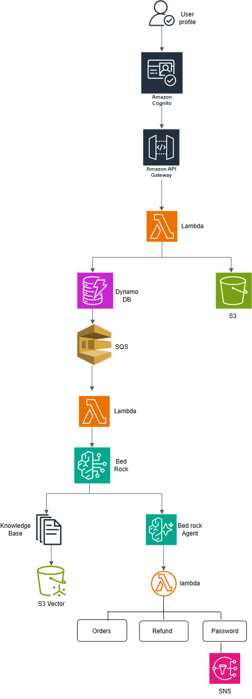
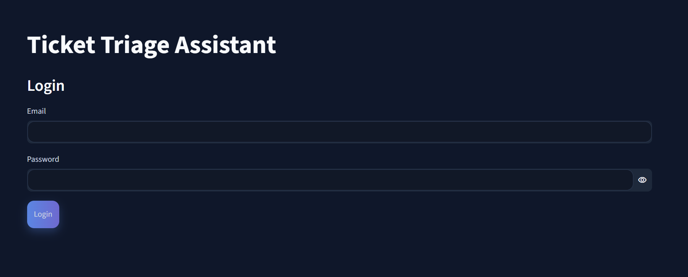
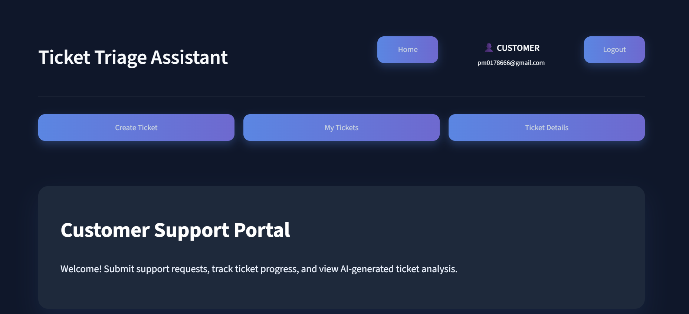
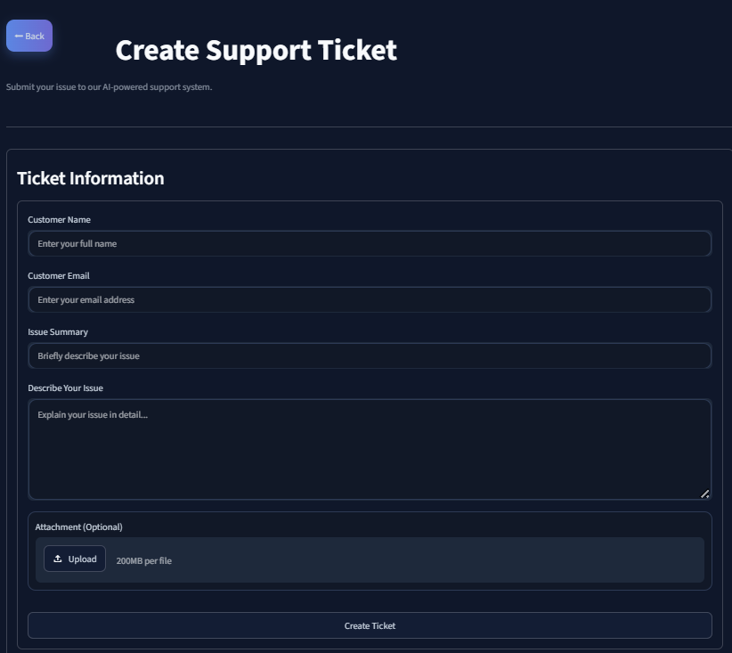
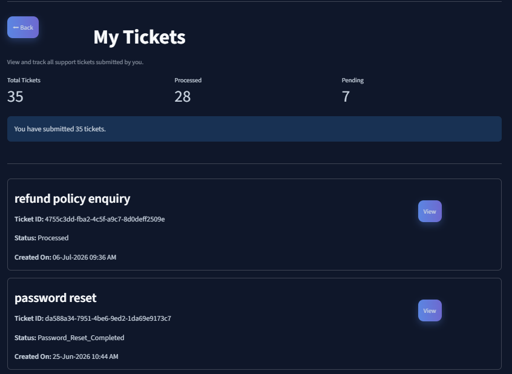
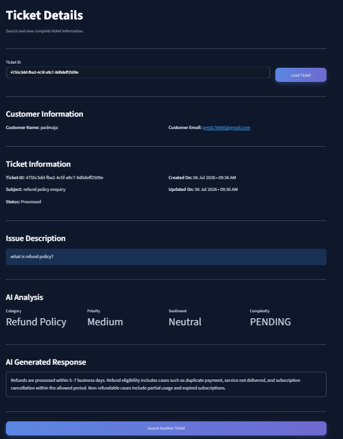
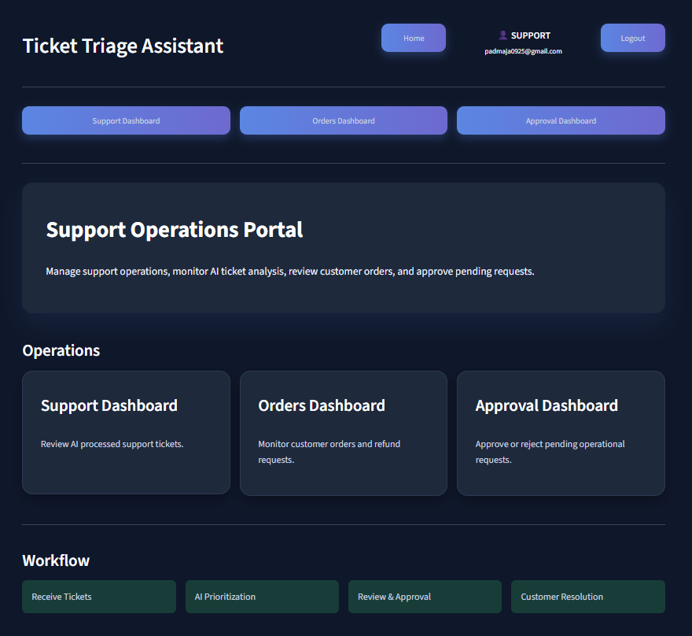
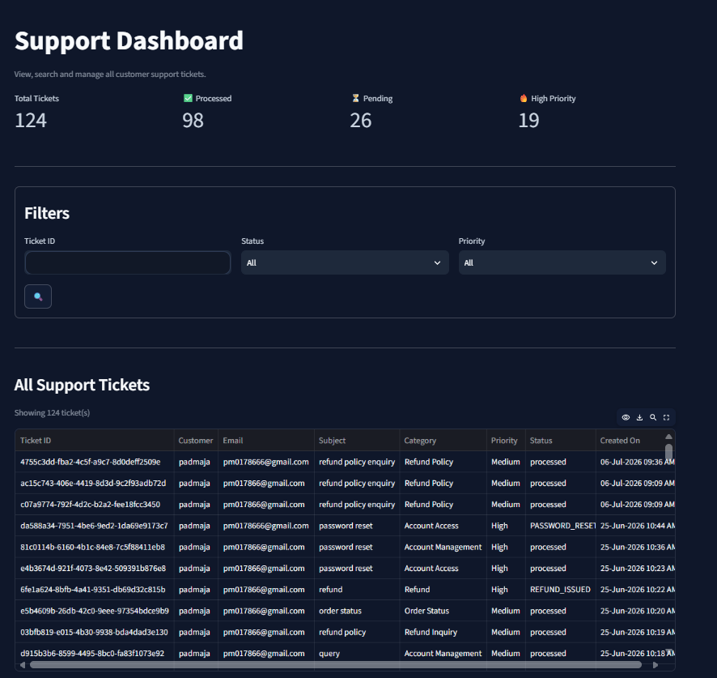
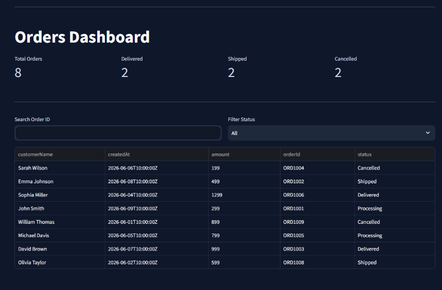
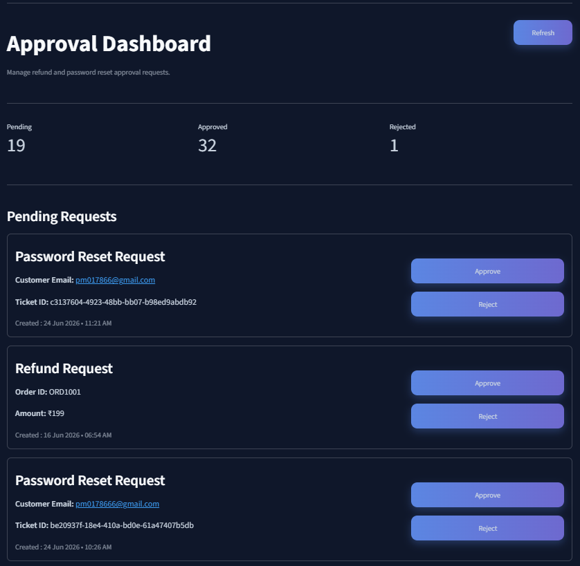

#  Intelligent Ticket Triage Assistant


An AI-powered customer support system built using **AWS Serverless** and **Amazon Bedrock** that automatically classifies support tickets, retrieves knowledge-based answers, performs operational tasks through AI Agents, and manages approval workflows using a Human-in-the-Loop approach.

The project demonstrates modern **Agentic AI architecture** by integrating Amazon Bedrock Agents with AWS serverless services to automate customer support operations while keeping humans involved for sensitive actions such as refunds and password resets.

---

#  Project Overview

The Intelligent Ticket Triage Assistant enables customers to raise support tickets through a web interface while AI automatically analyzes the request, determines its category and priority, retrieves relevant information from the Knowledge Base, or executes business actions using Amazon Bedrock Agent Action Groups.

The solution is built on a completely serverless AWS architecture and uses Retrieval Augmented Generation (RAG) for answering policy and documentation-related queries.

---


#  Table of Contents

- [Project Overview](#-project-overview)
- [Features](#-features)
- [Architecture](#-architecture)
- [AWS Services Used](#-aws-services-used)
- [Technology Stack](#️-technology-stack)
- [Project Workflow](#-project-workflow)
- [Project Structure](#-project-structure)
- [Running the Project](#️-running-the-project)
- [Environment Variables](#-environment-variables)
- [Security](#-security)
- [Design Decisions](#-design-decisions)
- [Future Enhancements](#-future-enhancements)
- [Demo](#-demo)
- [Screenshots](#-screenshots)
- [Author](#-author)


#  Features

- AI-powered ticket classification
- Automatic priority detection
- Ticket complexity analysis
- Retrieval Augmented Generation (RAG)
- Amazon Bedrock Agent orchestration
- Order Status lookup
- Refund approval workflow
- Password reset workflow
- Human-in-the-loop approvals
- Attachment upload to Amazon S3
- Customer Dashboard
- Support Dashboard
- Role-based authentication using Amazon Cognito
- Serverless deployment using AWS SAM

---

#  Architecture

The application follows an event-driven serverless architecture.

## Architecture Diagram



---

#  AWS Services Used

| Service | Purpose |
|----------|----------|
| AWS SAM | Infrastructure as Code |
| API Gateway | REST APIs |
| AWS Lambda | Business Logic |
| Amazon DynamoDB | Ticket & Order Storage |
| Amazon SQS | Asynchronous Processing |
| Amazon S3 | Attachments & Knowledge Base Documents |
| Amazon Bedrock Agent | AI Orchestration |
| Amazon Bedrock Knowledge Base | Retrieval Augmented Generation |
| Amazon Cognito | Authentication |
| Amazon SNS | Notifications |
| Amazon SES | Password Reset Emails |
| IAM | Permissions |

---

# ⚙️ Technology Stack

### Frontend

- Streamlit

### Backend

- Python
- AWS Lambda
- AWS SAM
- API Gateway

### AI

- Amazon Bedrock Agent
- Amazon Bedrock Knowledge Base
- Amazon Nova Lite

### Database

- Amazon DynamoDB

### Storage

- Amazon S3

### Authentication

- Amazon Cognito

---

#  Project Workflow

## 1. Infrastructure Deployment

All cloud resources are provisioned using AWS SAM.

Resources include:

- API Gateway
- Lambda Functions
- DynamoDB Tables
- Amazon SQS
- Amazon S3
- Amazon SNS
- IAM Roles

Deployment commands:

```bash
sam build
sam deploy
```

---

## 2. Customer Authentication

Customers log in through Amazon Cognito.

Role-based access is implemented for:

- Customer
- Support Team

---

## 3. Ticket Creation

The customer creates a ticket by providing:

- Name
- Email
- Subject
- Description
- Attachment (Optional)

The Ingestion Lambda:

- Generates a unique Ticket ID
- Creates timestamp
- Generates an S3 pre-signed upload URL
- Stores ticket metadata in DynamoDB
- Sends processing request to Amazon SQS

---

## 4. Attachment Upload

Attachments are uploaded directly to Amazon S3 using pre-signed URLs.

Only the object key is stored in DynamoDB.

This minimizes Lambda execution time and supports larger files efficiently.

---

## 5. Asynchronous Processing

Instead of directly invoking AI, tickets are pushed into Amazon SQS.

Processor Lambda consumes messages from the queue.

Benefits include:

- Better scalability
- Fault tolerance
- Loose coupling
- Improved reliability

---

## 6. AI Ticket Processing

Processor Lambda invokes Amazon Bedrock Agent.

The agent automatically performs:

- Ticket Classification
- Priority Detection
- Complexity Detection
- Customer Response Generation

The processed information is stored back in DynamoDB.

---

## 7. Retrieval Augmented Generation (RAG)

Knowledge documents are stored in Amazon S3 and synchronized with Amazon Bedrock Knowledge Base.

For informational requests, the Bedrock Agent retrieves the most relevant document before generating a response.

Supported knowledge includes:

- Refund Policy
- Password Policy
- Billing Information
- Help Documentation

---

## 8. AI Action Groups

Operational requests are handled using Amazon Bedrock Agent Action Groups.

Implemented tools include:

### Order Status

Retrieves:

- Order Status
- Order Amount

### Approval Workflow

Creates approval requests for:

- Refund Requests
- Password Reset Requests

---

## 9. Human-in-the-Loop Approval

Sensitive operations require manual approval.

Workflow:

```
Customer

↓

Bedrock Agent

↓

Approval Request Lambda

↓

Approvals Table

↓

Support Dashboard

↓

Approve / Reject

↓

Approval Action Lambda

↓

Refund / Password Reset
```

---

## 10. Password Reset

The Reset Password Lambda:

- Retrieves customer email
- Generates reset token
- Creates reset link
- Sends email using Amazon SES
- Updates ticket status

---

## 11. Customer Portal

Features include:

- User Login
- Create Ticket
- Upload Attachments
- View My Tickets
- Track Ticket Status
- View AI Response
- Ticket Details

---

## 12. Support Portal

Support users can:

- View all tickets
- Monitor dashboards
- Review approvals
- Approve requests
- Reject requests
- Track ticket status

---

# Project Structure

```
Intelligent-ticket-triage-assitant/

├── TicketTriageUI/
│   ├── app/
│   ├── assets/
│   ├── services/
│   ├── Home.py
│   └── requirements.txt
│
├── ticket-triage-assistant/
│   ├── ingestion/
│   ├── processor/
│   ├── approval-request/
│   ├── approval-action/
│   ├── issue-refund/
│   ├── reset-password/
│   ├── get-order-status/
│   ├── template.yaml
│   └── samconfig.toml
│
├── demo/
├── docs/
├── .env.example
├── README.md
└── .gitignore
```

---

#  Running the Project

## Backend

```bash
cd ticket-triage-assistant

sam build

sam deploy
```

---

## Frontend

```bash
cd TicketTriageUI

pip install -r requirements.txt

streamlit run Home.py
```

---

# Environment Variables

Copy:

```
.env.example
```

to

```
.env
```

Update the required configuration values before running the application.

---

# Security

- Sensitive credentials are never committed to GitHub.
- AWS Lambda runtime configuration is managed through AWS SAM.
- Environment-specific configuration is stored separately.
- Authentication is handled using Amazon Cognito.
- Password reset emails are sent securely through Amazon SES.

---

# Future Enhancements

- Multi-language support
- SLA prediction
- Ticket sentiment analytics
- Automatic ticket routing
- Real-time monitoring dashboard
- Voice-enabled ticket creation
- Multi-model AI comparison
- Chat interface for customer support

---

# Demo

### Application Demo

<p align="center">

</p>


---


#  Screenshots

## Login



---

## Customer Dashboard



---

## Create Ticket



---

## My Tickets



---

## Ticket Details



---

## Support Home Page



---

## Support Dashboard



---

## Orders Dashboard



---

## Approval Dashboard



---

# Author

**Padmaja**

Developed as an AI-powered serverless customer support solution using AWS and Amazon Bedrock.

---

# License

This project is developed for educational and demonstration purposes.